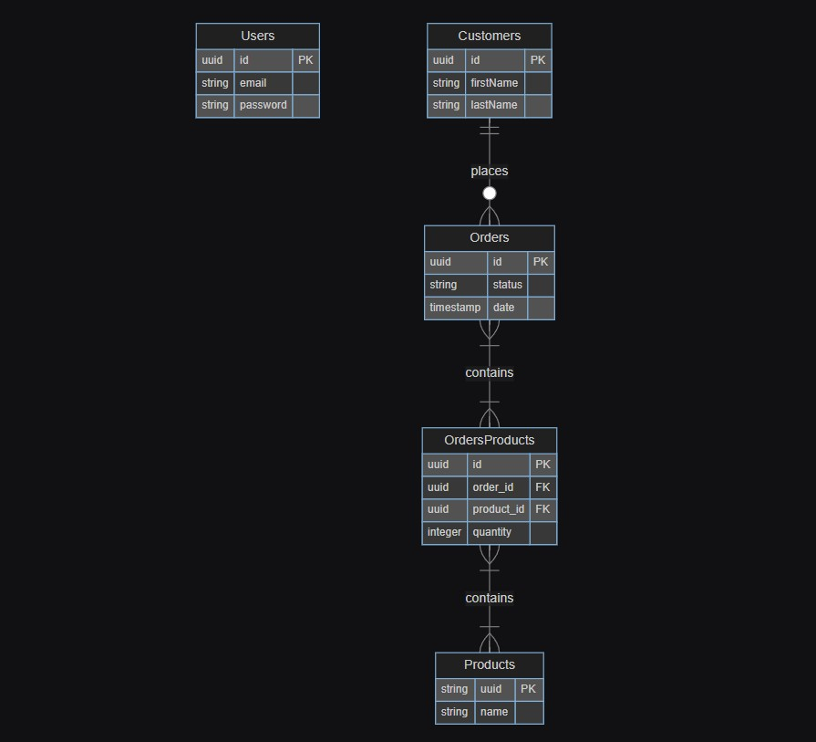

# Project Documentation

# Table of Contents

- [Requisites and Context](#requisites-and-context)
- [Domain definition](#domain-definition)
- [ER Schema](#er-schema)
- [Sequence Diagram](#sequence-diagram)
- [Backend endpoints](#backend-endpoints)
- [Frontend components](#frontend-components)

## Requisites and Context

The project consist on building a web application that helps to monitor and manage daily users orders. 
I wanted to give more context on this: a team of a flower shop, let's name it <strong>Flowerly</strong>, is expanding and they can't manage all the orders using spreadsheets anymore, but they need a web application that helps them registering customers and their purchases.  

The application should be able to:

- login the company employees (users);
- manage orders;
- manage products;
- manage customers;

## Domain definition

In the following bullet point, I defiend the entities that are gonna be represented in the application.  
For each of them, I wrote a list of assertions that defines the perimeter of action and the responsabilities of every entity.

- <strong>Users</strong>

  - can't be created at runtime --> exists a limited set of users that pre-exists in the database
  - they can log in in the application
  - they administrate orders, products and customers

- <strong>Customers</strong>

  - they are been created by the users
  - it's possibile to associate orders to them
  - they can be deleted but only if they don't have associated orders to them

- <strong>Orders</strong>

  - they can be created by the users
  - they can have only one customer associated
  - an order can be created only if contains at leat one product
  - an order has a defined status (Created, Processed, Shipped, Delivered, Cancelled)
  - the order statuses can't be created at runtime
  - they can be deleted always

- <strong>Products</strong>
  - they can be created by users
  - they can be modified by users
  - they can be deleted only if they are not associated to any order

The principal domain is the entity <strong>Customers</strong> from which derives the sub-domain <strong>Orders</strong> and the sub-sub-domain <strong>Products</strong>.  
The entity <strong>Users</strong> is excluded from this kind of hierarchical modeling, beacuse it is not connected in any way to the others entities although it manages them all.  
So the final structure of domain dependecies is the following: 

- Users
- Customers
  - Orders
    - Products

## ER Schema

Now that we have defined the domains and their behaviours, we can write down the ER Schema of the application.

## Sequence Diagram

## Back-end Endpoints

## Front-end Components
